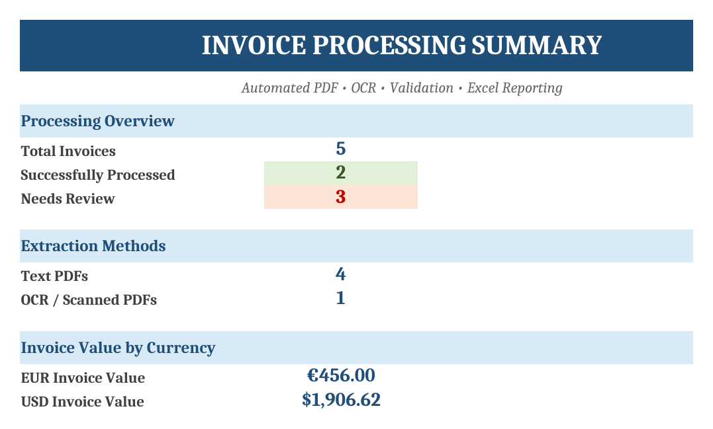

# Invoice Document Automation

A Python-based invoice processing workflow that converts PDF invoices into structured, validated Excel data.

The workflow automatically detects whether a PDF contains extractable text or requires OCR, extracts key invoice fields, validates the results, flags problematic records for review, and generates a formatted Excel report.

## Example Output

## What It Does

The workflow processes a folder of invoice PDFs and automatically:

- Extracts text from digital PDFs
- Detects image-only or scanned PDFs
- Falls back to Tesseract OCR when needed
- Extracts structured invoice fields
- Normalizes invoice dates, flagging ones that are genuinely ambiguous
- Detects invoice currency (USD, EUR, GBP — symbol or code)
- Validates required fields
- Checks subtotal + tax against the reported total
- Flags questionable invoices as `NEEDS REVIEW`
- Generates a formatted Excel workbook with a summary dashboard

## Extracted Fields

The current demo extracts:

- Source file
- Extraction method (`TEXT` or `OCR`)
- Vendor
- Invoice number
- Invoice date
- Due date
- Customer
- Currency
- Subtotal
- Tax
- Total
- Validation status
- Validation issues

## Validation Examples

The workflow does not silently accept every extracted value.

For example, it can flag missing required information:

    Missing required field: invoice_number

It can also detect financial inconsistencies:

    Total mismatch: expected 540.00, found 590.00

It also refuses to guess at a date it cannot read with certainty:

    Ambiguous invoice date '03/04/2026' read as MDY

Invoices that fail validation are automatically routed to a dedicated `Needs Review` worksheet.

## Dates

A numeric date is the easiest thing in invoice processing to get quietly wrong. `03/04/2026` is 4 March in the United States and 3 April across most of Europe, and both readings look entirely plausible in a spreadsheet three weeks later.

The workflow handles this in three steps:

- When one component exceeds 12, the value settles its own order. `09/15/2026` can only be September 15, whichever convention was intended.
- When both components could be a month, the date is parsed for display and flagged for review rather than presented as certain.
- When the convention is known, `--date-order MDY` or `--date-order DMY` declares it and the flag is no longer raised. A client who says "our suppliers are European" has resolved the question, and flagging every date after that would be noise rather than diligence.

## Demo Test Cases

The repository includes synthetic invoice samples designed to test different document-processing scenarios.

| Sample | Scenario | Extraction | Result |
| --- | --- | --- | --- |
| `invoice_001.pdf` | USD invoice dated `09/10/2026` | TEXT | NEEDS REVIEW — ambiguous date |
| `invoice_002.pdf` | EUR invoice, unambiguous date | TEXT | OK |
| `invoice_003.pdf` | Subtotal and tax do not sum to the total | TEXT | NEEDS REVIEW — total mismatch |
| `invoice_004.pdf` | Missing invoice number | TEXT | NEEDS REVIEW — two issues |
| `invoice_005.pdf` | Image-only scanned invoice | OCR | OK |

Running with no flags gives 2 clean and 3 needing review. `invoice_001.pdf` is a
deliberate illustration: the file itself is perfectly well formed, and it is held
back only because `09/10/2026` could be September 10 or October 9. Declaring the
convention with `--date-order MDY` clears it and leaves 3 clean and 2 needing
review.

All sample companies, invoices, addresses, and transaction data are fictional and created for demonstration purposes.

## Excel Output

The generated workbook contains three worksheets.

### Summary

A formatted processing dashboard showing:

- Total invoices processed
- Successfully processed invoices
- Invoices requiring review
- Text PDF count
- OCR / scanned PDF count
- Invoice value by currency

### Invoices

A structured table containing all extracted invoice data, extraction methods, validation statuses, and issues.

### Needs Review

A separate queue containing only invoices that failed validation, making manual review faster and more targeted.

## Workflow

    PDF Invoices
         |
         v
    Text Layer Detection
         |
         +------ Text Available ------> Direct Extraction
         |
         +------ No Text Layer -------> OCR
                                          |
                                          v
                                Structured Parsing
                                          |
                                          v
                                   Validation
                                          |
                             +------------+------------+
                             |                         |
                            OK                   NEEDS REVIEW
                             |                         |
                             +------------+------------+
                                          |
                                          v
                                  Excel Report

## Tech Stack

- Python 3
- pandas
- openpyxl
- PyMuPDF
- Pillow
- pytesseract
- Tesseract OCR
- ReportLab

## Project Structure

    invoice-document-automation/
    ├── data/
    │   └── invoices/
    ├── output/
    ├── src/
    │   ├── extractor.py
    │   ├── generate_samples.py
    │   ├── invoice_parser.py
    │   ├── main.py
    │   ├── style_report.py
    │   └── validator.py
    ├── tests/
    │   └── test_invoice_pipeline.py
    ├── .gitignore
    ├── README.md
    └── requirements.txt

## Installation

Create and activate a virtual environment:

    python3 -m venv venv
    source venv/bin/activate

Install Python dependencies:

    pip install -r requirements.txt

Tesseract OCR must also be installed separately on the system.

On macOS with Homebrew:

    brew install tesseract

## Run the Demo

Generate the synthetic sample invoices:

    python src/generate_samples.py

Process all invoices and create the Excel report:

    python src/main.py

The finished workbook is generated at `output/invoice_report.xlsx`.

Against your own files:

    python src/main.py --input ~/invoices --output q3_invoices.xlsx
    python src/main.py --date-order DMY
    python src/main.py --help

## Tests

    python -m pytest tests/ -q

31 tests covering date parsing and ambiguity detection, currency symbols and codes, money parsing, field extraction across layouts, required-field validation, and arithmetic checks.

## Design Approach

This project follows a review-first approach to document automation.

Instead of guessing when required information is missing, financial values are inconsistent, or a date could be read two ways, the workflow records the issue and routes the invoice for manual review.

An invoice that arrives flagged costs someone a minute. An invoice that arrives confidently wrong costs considerably more, and nobody finds out until the figures are already in use.

This pattern can be adapted to business workflows involving invoices, receipts, purchase orders, statements, forms, and other semi-structured documents.

## Portfolio Note

This project is a portfolio demonstration built with synthetic data. It demonstrates a complete document-processing workflow from PDF ingestion through OCR, structured extraction, validation, exception handling, and Excel reporting.
